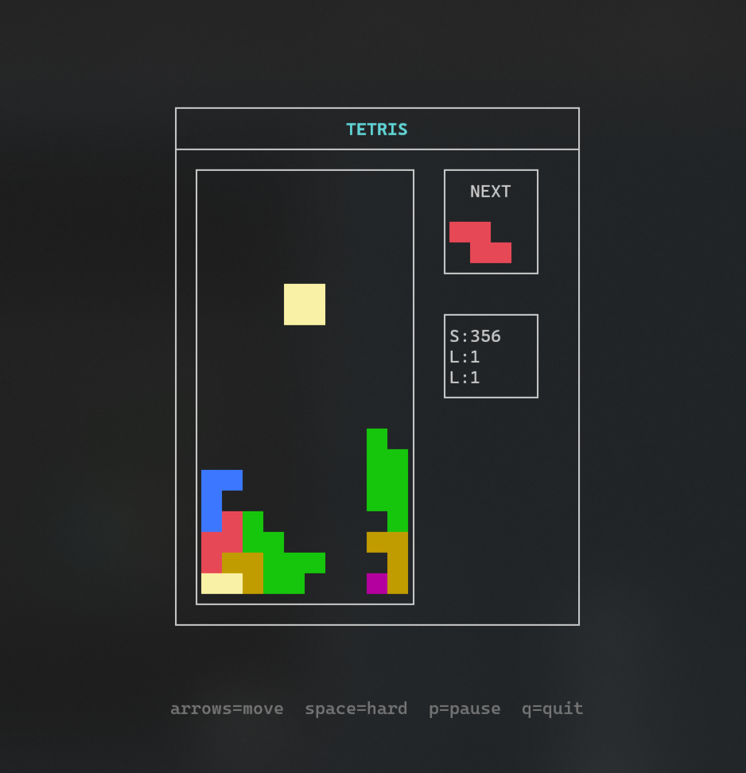

# Termtris

A Tetris clone for the terminal, written in Rust.



### Game Structure

- **GAME BOARD**: The main play area where pieces fall. It is 10 cells wide and 20 cells tall.
- **NEXT**: Shows the next piece that will appear after the current piece lands.
- **S**: Score - points earned by clearing lines. More lines cleared at once yields higher points.
- **L**: Lines - total number of complete lines cleared.
- **L**: Level - current difficulty level. Increases every 10 lines cleared, making pieces fall faster.

## Controls

| Key   | Action                |
| ----- | --------------------- |
| ← / → | Move piece left/right |
| ↓     | Soft drop             |
| ↑     | Rotate piece          |
| Space | Hard drop             |
| P     | Pause/Resume          |
| Q     | Quit                  |

## Build & Run

### From Source

```bash
cargo run --release
```

### From Binary (Linux/macOS/Windows)

#### Quick Install (Linux/macOS/WSL/Git Bash)

```bash
curl --proto '=https' --tlsv1.2 -sSf https://raw.githubusercontent.com/snvshal/termtris/main/install.sh | sh
```

For Windows PowerShell, download the `.zip` from GitHub Releases and extract `termtris.exe` into a folder on your `PATH`.
On older Linux systems with glibc < 2.31, the installer will automatically use the musl build.

#### Manual Download

Download the latest release from [GitHub Releases](https://github.com/snvshal/termtris/releases) for your platform.
Checksum files (`.sha256`) are provided alongside each release artifact.

#### Supported Platforms

- Linux: `x86_64-unknown-linux-gnu`, `x86_64-unknown-linux-musl`, `aarch64-unknown-linux-gnu`, `aarch64-unknown-linux-musl`
- macOS: `x86_64-apple-darwin`, `aarch64-apple-darwin`
- Windows: `x86_64-pc-windows-msvc`

<!--
#### From crates.io

```bash
cargo install termtris
```
-->

## Requirements

- Rust (latest stable)
- cargo

## License

MIT
